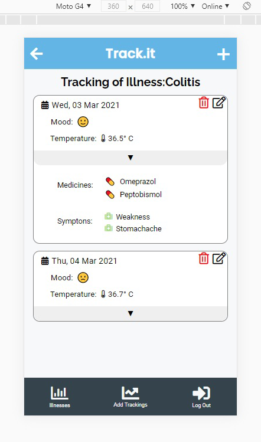

## Final Capstone Front-End Project: Tracking app

## Table of Contents

* [About the Project](#about-the-project)
* [Illnest](#illnest)
* [Installation](#installation)
* [Technologies used](#technologies-used)
* [Author](#author)
* [Potential future features](#potential-features)
* [Show your Support](#show-your-support)
* [Acknowledgments](#acknowledgments)

<!-- ABOUT THE PROJECT -->
## About The Project

The objective of this project was to create a tracking App in which a user is presented with a list of things to be measured. In this health care app we track the information from an api consumed with react and redux.

### Live Demo link
[Live Demo](https://vigorous-pike-400a13.netlify.app/)



<!-- THE APP -->
## illnest

On illnest, you can track a specific illness you have, whether is chronic or is a recent affliction, it can be measure here. 

On the Login page, you write your username and password. If you are not registered, you can go to Signup and fill the form with your data. 

Then on the main page, you have all the illnesses/afflictions you want to monitor. 

If you click on a specific one, you are redirected to all the trackings you have registered previously. Some of the data included in this section are:
- Date of the Tracking
- The mood of the date
- Temperature
- Medicines
- Symptoms

You can always delete/add new illnesses and trackings.


<!-- INSTALLATION -->
### Installation

You can always use the [Live Demo](https://vigorous-pike-400a13.netlify.app/) or install it locally using these steps:

#### Clone my repository

``` git clone https://github.com/Ceci007/final-capstone-frontend.git ```

#### Go to my project's folder

``` cd final-capstone-frontend ```

#### Get the dependencies needed

``` npm install ```

#### Open the project
``` npm run start ```


<!-- TECHNOLOGIES USED -->
## Technologies used

* React
* Redux
* Javascript
* Eslint
* Netlify


<!--AUTHOR -->
## Author
👤 ***Cecilia Benitez***

- Github: [@Ceci007](https://github.com/Ceci007)
- Twitter: [@CeciDeveloper](https://twitter.com/CeciDeveloper)
- Linkedin: [LinkedIn](https://www.linkedin.com/in/cecilia-benítez)
- Portfolio: [cecibenitez.com](https://www.cecibenitez.com/)

<!-- POTENTIAL FEATURES -->
## Potential features

* Create a tablet and mobile views for all screens.
* Create data charts for measuring progress.
* Use React Hooks.
* Include more tests

<!-- SHOW YOUR SUPPORT -->
## Show your Support

Give a star if you like this project!

<!-- ACKNOWLEDGEMENTS -->
## Acknowledgments

* [Microverse](https://www.microverse.org/)
